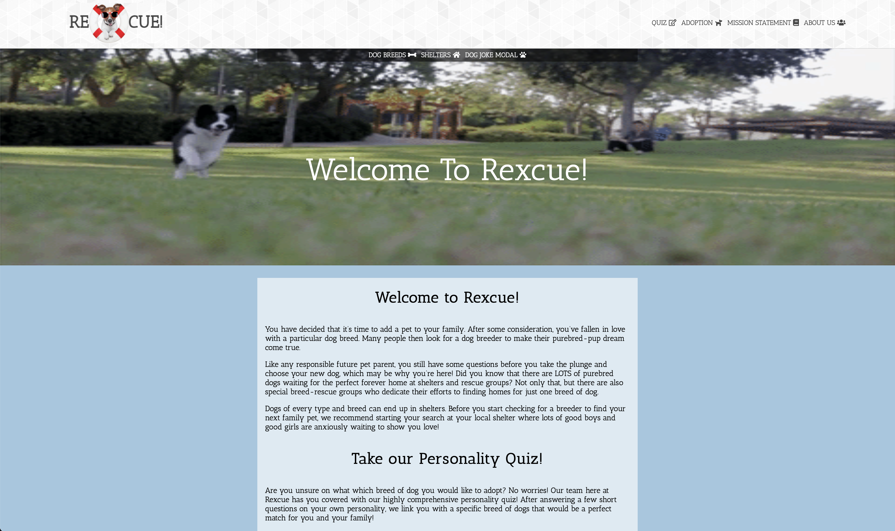
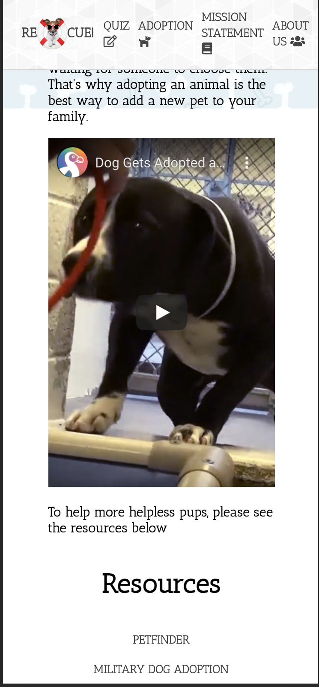
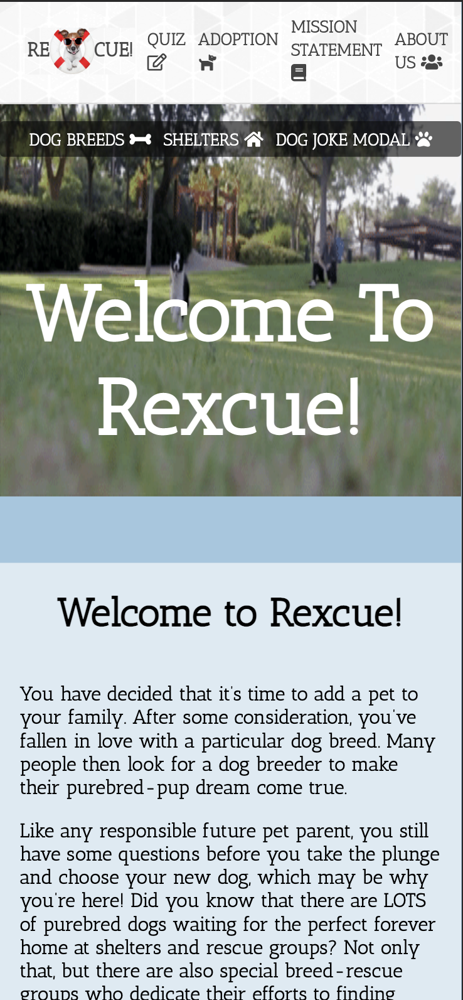
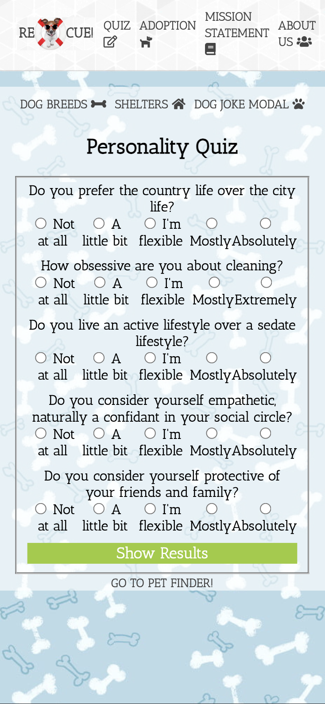

<h1>Front End Project</h1>

# The Disembodied Voices

###
Brittany
###
Nick
###
Zach

<h1>About<h1>

###
Our team created a dog adoption website using the Petfinder API. This project is a collection of resources that allow users to find the perfect companion for their lifestyle.

Our quiz allows users to select a few characteristics and prefrences that match them to a compatible dog breed. 

Our adoption page features resources to locate dogs that need loving homes.
We have featured a shelter finder and a breed list to educate our users about the different breed possibilities they could adopt as well as where to find these amazing dogs.

<h3>Dependencies</h3>
<ul>
<li>
<strong>HTML</strong>
</li>
<li>
<strong>JavaScript</strong>
</li>
<li>
<strong>CSS</strong>
</li>
<li>
<strong>Github</strong>
</li><li>
<strong>Asana</strong>
</li>
</ul>

# Resources

Breed list API link for PICTURES - https://dog.ceo/api/breed/"ThisTextIsWhereTheBreedNameGoes"/images/random

Dog Facts -
https://dog-facts-api.herokuapp.com/api/v1/resources/dogs/all to get all the facts at once.
Change all to parameter ?number= to specify the number of facts you want to receive.
Change all to parameter ?index= to specify the index of the fact you are targeting.

Rescue Shelter Resources - 
Petfinder.com
phshelter.com
rescuegroups.org (API "https://test1-api.rescuegroups.org/http/v2.json")

fetch translator - https://kigiri.github.io/fetch/

<a href="https://www.petfinder.com/ ">Petfinder </a>

<a href="https://www.petfinder.com/pet-adoption/dog-adoption/military-dog-adoption/ ">Military Dog Adoption </a>

# Screenshots

